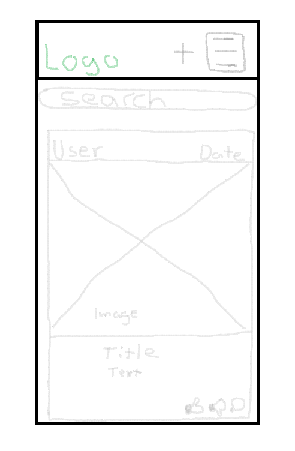
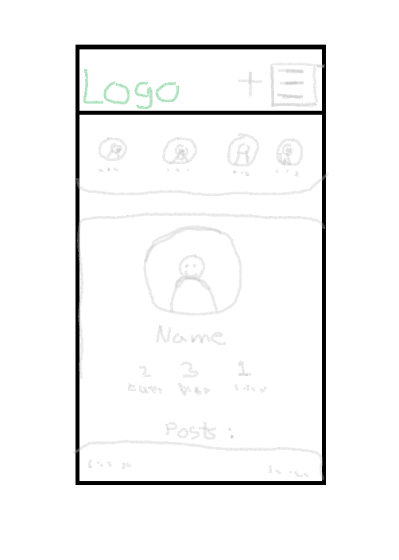
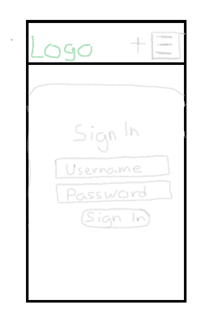
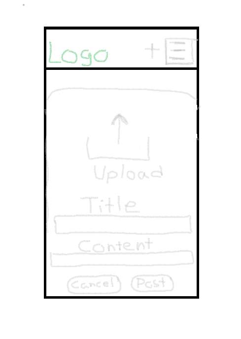

# Golf Shot
## Project goals
Golf Shot is a social media website where golfers all over the world can share their golf life! 

The primary goal of this project is to develop a user-friendly web application that allows image sharing among users. The platform aims to create a golf community where golfers can upload their images and interact through likes and comments on those images shared by others.

## Table of contents
- [Golf Shot](#tribehub)
  * [Project goals](#project-goals)
  * [Table of contents](#table-of-contents)
  * [User stories](#user-stories)
    + [Themes](#themes)
    + [Epics](#epics)
    + [User stories](#user-stories-1)
  * [Agile development methodology](#agile-development-methodology)
  * [Planning](#planning)
    + [Mockups](#mockups)
    + [Data models](#data-models)
  * [Design](#design)
    + [Colours](#colours)
    + [Fonts](#fonts)
  * [Features](#features)
  * [Frameworks, libraries and dependencies](#frameworks--libraries-and-dependencies)
    + [React-Router-DOM](#react-router-dom)
    + [ReactDOM](#reactdom)
    + [Axios](#axios)
    + [JWT Decode](#jwt-decode)
  * [React features used to enhance user experience](#react-features-used-to-enhance-user-experience)
    + [Custom hooks](#custom-hooks)
  * [Testing](#testing)
    + [Manual testing](#manual-testing)
    + [Validator testing](#validator-testing)
    + [W3C CSS validator](#w3c-css-validator)
    + [ESLint JavaScript validator](#eslint-javascript-validator)
    + [WAVE web accessability testing](#wave-web-accessability-testing)
    + [Lighthouse testing](#lighthouse-testing)
    + [Resolved bugs](#resolved-bugs)
    + [Unresolved bugs](#unresolved-bugs)
  * [Deployment](#deployment)
  * [Credits](#credits)
    + [Code](#code)
    + [Media](#media)

## User stories
For detailed information regarding functionalities and features, please refer to the [User Stories](https://github.com/samuelkerstell/project5-react/issues)

## Agile development methodology
### Github Issues & Github Projects
For the user stories I used Github issues and labeled them with "Must Have" "Should Have", "Could Have", "Won't Have" depending on what I felt was needed.

[Github Projects](https://github.com/users/samuelkerstell/projects/5) was utilized as a visual tool to organize these labeled user stories into a table representing different stages of development, such as To Do, In Progress,and Done. This facilitated better project management, allowing me to track the progress of user stories through various stages and prioritize tasks efficiently based on their importance and category.

## Planning
### Wireframe
Wireframes made for mobile version made in Paint:
| Wireframe | Mobile |  - |
| --- | --- | --- | 
| Home Page / Posts Page |  |
| Profile Page |  |
| Sign In Page |  | 
| Sign Up Page |  | 
| Post Create Form | |

## Design
### Colors
| Color         |Hex    |
| ---------- | ------ |
| Forest Green |  #1b5028|
| Rolex Green |  #006039|
| White |  #ffffff |
| Light Grey |   #dadadf |
| Grey |  #c1c1c5 |
| Off White |  #f5f5f5 |

The choice of Forest green was chosen to reflect the essence of golf and golf courses. Rolex green, lighter than forest green, was used as a subtle background, maintaining harmony without overpowering the design. This color combination, along with white, created a visually appealing and user-friendly interface, aligning with golfs aesthetics while keeping the design simple and modern.

### Fonts
Fonts Used:
  * [Google Fonts Poppins](https://fonts.google.com/specimen/Poppins?query=poppins&sort=popularity)
  * [Google Fonts Varela Round](https://fonts.google.com/specimen/Varela+Round)

Varela Round was chosen for the navbar and logo to because it's clean and sporty.

Poppins was used for the rest of the application, maintains a clean and modern appearance, offering a balance between readability and a sporty aesthetic.

## Features
### Navbar
[User Story: Navigation](https://github.com/samuelkerstell/project5-react/issues/7)

The Navbar allows users to navigate through the site easily.
The Navbar contains the Logo, Home, Feed, Liked, Sign In/Out, Sign Up and the Avatar that takes the user to their profile page.

Navbar Logged In:

Navbar Logged Out:

### Sign Up form
[User Story: Sign Up Form](https://github.com/samuelkerstell/project5-react/issues/29)

The sign up form allows users to create an account if the form is valid. If the form is not valid the user will be alerted.

### Sign in form
[User Story: Sign In Form](https://github.com/samuelkerstell/project5-react/issues/28)

The sign up form allows users sign in to their account if the form is valid. If the form is not valid the user will be alerted.

### Home Page / Posts Page
[User Story: View Posts](https://github.com/samuelkerstell/project5-react/issues/16)  
[User Story: Search Posts](https://github.com/samuelkerstell/project5-react/issues/17)  
[User Story: Infinite Scroll](https://github.com/samuelkerstell/project5-react/issues/19)

The Posts Page contains all the latest posts from our golfers with the ability to like or dislike posts. The infinite scroll is implemented to keep loading posts instead of having to click "next page".

### Post Page
[User Story: Post Page](https://github.com/samuelkerstell/project5-react/issues/30)  
[User Story: Edit Post](https://github.com/samuelkerstell/project5-react/issues/4)  
[User Story: View Comments](https://github.com/samuelkerstell/project5-react/issues/24)  
[User Story: Add Comment](https://github.com/samuelkerstell/project5-react/issues/20)  
[User Story: Edit Comment](https://github.com/samuelkerstell/project5-react/issues/23)  
[User Story: Delete Comment](https://github.com/samuelkerstell/project5-react/issues/22)  
[User Story: Comment Date](https://github.com/samuelkerstell/project5-react/issues/21)

The Post Page enables users to access and interact with a detailed post. Users can view comments, comment dates, and comment on posts. Additionally, owner of the post have the ability to edit or delete the post.

### Feed Page
[User Story: View Posts](https://github.com/samuelkerstell/project5-react/issues/16)  

The Feed page is a modified version of the Posts page. It displays only the posts from users that the user follows.

### Liked Page
[User Story: View Posts](https://github.com/samuelkerstell/project5-react/issues/16)  

The Liked page is a modified version of the Posts page. It displays only the posts the user has liked.

### Search bar
[User Story: Search Posts](https://github.com/samuelkerstell/project5-react/issues/17)

The Search Bar allows user to search for posts or posts from certain users.

### Add Post 
[User Story: Add Post](https://github.com/samuelkerstell/project5-react/issues/2)

The Add Post page allows logged in users to easily create posts containing an image, title and content.

### Edit Post Page
[User Story: Edit Post](https://github.com/samuelkerstell/project5-react/issues/4)

The Edit Post page allows users to modify their existing posts. It displays the user's current image, title, content, and provides editable fields for each element.

### Like & Dislike
[User Story: Like A Post](https://github.com/samuelkerstell/project5-react/issues/13)  
[User Story: Dislike A Post](https://github.com/samuelkerstell/project5-react/issues/14)

Signed In users can show their thoughts on a post by liking or disliking a post.
Signed out users cannot like or dislike and will be shown a message that says "Sign in to like/dislike a post!"
Owners of a post can not like or dislike their own posts.

### Comments
[User Story: View Comments](https://github.com/samuelkerstell/project5-react/issues/24)
[User Story: Add Comment](https://github.com/samuelkerstell/project5-react/issues/20)  
[User Story: Edit Comment](https://github.com/samuelkerstell/project5-react/issues/23)  
[User Story: Delete Comment](https://github.com/samuelkerstell/project5-react/issues/22)  
[User Story: Comment Date](https://github.com/samuelkerstell/project5-react/issues/21) 

The comments section is found on the Post Page. Signed out users can view all comments. Signed in user can view all comments and also add their own comment. Owner of a comment can edit and delete their comment.

### Follow & Unfollow
[User Story: Follow/Unfollow Users](https://github.com/samuelkerstell/project5-react/issues/31)

Logged In users can follow and unfollow users to keep up with their posts.

### Profile Page
[User Story: Profile Page](https://github.com/samuelkerstell/project5-react/issues/25)  
[User Story: Edit Profile](https://github.com/samuelkerstell/project5-react/issues/26)  
[User Story: Update Username & Password](https://github.com/samuelkerstell/project5-react/issues/27)

The Profile Page shows profile statistics such as post count, follower count, following count and posts from a user.
The owner of the profile can click the dropdown menu to update profile image, username,password and the biography.

### Not Found Page
The "Page Not Found" page appears whenever a user attempts to access a page that isn't allowed or doesn't exist within the application.

## Re-use of components
I developed several reusable React components to minimize repeating code segments.

### `Asset.js`
The `Asset.js` component is used to display a loading spinner throughout the site.

### `Avatar.js` (Profile Image)
#### Component Functionality:
The `Avatar.js` component is built to showcase user profile image in a flexible and reusable manner. This component separates avatar display from other parts, making it easier to organize code and maintain. It can be adjusted for different heights and includes an optional text overlay, allowing for integration into various parts of the website with different designs and layouts.

It accepts parameters such as "src" for the image source, "height" (defaulting to 45 pixels), and "width" that is set to the height value for a symmetrical Avatar.

#### Reused in:
  * `Navbar.js` (Used to display profile image in the navbar as a profile page button.)
  * `Comment.js` (Used to display profile image beside the comment)
  * `CommentCreateForm.js` (Used to display profile image beside the comment input)
  * `Post.js` (Used to display profile image at top of the post)
  * `Profile.js` (Used to display profile image).

### `MoreDropdown.js`
The `MoreDropdown.js` component creates dropdown menus used for profile editing and managing posts or comments.

#### Component Functionality:
  - ThreeDots renders a fontawesome icon (three dots) and triggers a provided onClick   function when clicked. It uses React.forwardRef to enable access to the DOM node in order to position the menu.
  - The MoreDropdown component generates a dropdown menu using the Dropdown component from react-bootstrap. It features a Dropdown.Toggle that uses the ThreeDots component as the dropdown button. Within the Dropdown.Menu there is two Dropdown.Item that contains:
    - Edit: Utilizes the handleEdit function when clicked, used to edit content. 
    - Delete: Executes the handleDelete function upon selection, used to delete content.
  - ProfileEditDropdown component is similar to the MoreDropDown component but its used to edit the user profile. The difference is the use of the useHistory hook instead of handleEdit and handleDelete. Within the Dropdown.Menu there is three Dropdown.Item that contains:
    - Edit Profile: Utilizes the history.push to navigate the user to the edit the profile 
    - Edit Username: Utilizes the history.push to navigate the user to the edit username page
    - Edit Password: Utilizes the history.push to navigate the user to the edit password page

#### Reused in:
  * `Comments.js` (Used to display dropdown beside comment)
  * `Post.js` (Used to display dropdown top right of post card)
  * `ProfilePage.js` (Used to display dropdown on profile)

### `Post.js`
The Post component is responsible for displaying post details and functionalities like editing, deleting, liking, and disliking posts. It receives various props regarding post information and uses hooks to handle user-related actions. The component renders post details, owner information, and icons for liking/disliking posts based on user interactions and ownership status.

#### Reused in:
  * `PostPage.js` (Used to display a detailed view of a post.)
  * `PostsPage.js` (Used to display list of posts)
  * `ProfilePage.js` (Used to display posts from the specific user)

### `React Infinite Scroll`
The 'React Infinite Scroll' feature ensures a seamless experience by continuously loading posts and comments without requiring users to click on a "next page" button.

#### Used in:
  * `PostsPage.js` (Used to keep loading posts)
  * `PostPage.js` (Used to keep loading comments)
  * `ProfilePage.js` (Used to keep loading posts)

### `NotFound.js`
`NotFound.js` informs users that the page they are trying to access doesn't exist.

Is reused on every page that doesn't exist or the user doesn't have access to.

### CRUD functionality
Golf Shot features full Create, Read, Update and Delete functionality, via the UI implemented in React and the Django Rest Framework API.

  * Create - Users can register a new user account. Users can then create posts and comments.
  * Read - Users can view posts shared by others. Users can read comments associated with each post to gain insights to discussions.   
  * Update - Authenticated users can update their posts, comments, profile image, display name and password.   
  * Delete - Authenticated users can delete their posts and comments.

### Future improvements and features

#### Short term future improvements
Because I had so much time taken up from all the bugs these improvements would've been added:
  * More original styling
  * Video Support
  * Refractoring of the handleLike & handleDislike as well as the handleUnlike &    handleUndislike

#### Longer term future features
  * Like & Dislike Comments
  * Being able to reply to a comment
  * Being able to delete an account

## Frameworks, libraries and dependencies
### Axios
[Axios](https://axios-http.com/docs/intro) was chosen for this project primarily due to its simplicity and ease of use in handling HTTP requests and managing responses. It ensured reliable communication with the backend server. Axios provided a consistent and unified method for managing API requests and responses across various components of the project, contributing to a more coherent and manageable codebase.

### JWT Decode
Was used to decode Base64URL encoded JSON web tokens.

### React Bootstrap
React Bootstrap was used throughout the Golf Shot app because it offers lots of ready-made design parts that work well with React. It helps make the app's design look good on different devices and saves time in building components from scratch.

### ReactDOM
ReactDOM was employed in this project to efficiently manage the updating and rendering of React components onto the actual DOM. Through React DOM, the Golf Shot application was able to dynamically render and update its user interface components, ensuring a responsive and interactive user experience within the browser environment.

### React Infinite Scroll
To implement infinite scrolling.

### React-Router-DOM
React Router DOM was integrated into the project to facilitate the creation of single-page applications. By utilizing this library, the Golf Shot application could consist of numerous pages or components without the need to refresh the entire page.

### React Router 

To control what the user sees depending on the URL they have accessed in the browser.

### Font Awesome
[Font Awesome](https://fontawesome.com) was used for fonts on the site.

## Testing
### Manual testing

## Manual Testing
| `Feature` | `Expected Outcome` | `Testing Performance` | `Result` | `Pass/Fail`|
| ----------|--------------------|-----------------------|----------|------------|
| `Navbar Signed Out` |  |
| Logo  | When clicked, user will be redirected to the Home Page. | Clicked on logo | Redirected to the Home Page  | Pass |
| Home link | When clicked, user will be redirected to the Home Page. | Clicked on Home  | Redirected to the Home Page | Pass |
| Sign In link | When clicked, user will be redirected to the Sign In Page. | Clicked on Sign In  | Redirected to the Signed In Page | Pass |
| Sign Up link | When clicked, user will be redirected to the Sign Up Page. | Clicked on Sign Up  | Redirected to the Signed Up Page | Pass |
| `Navbar Signed In` |  |
| Logo  | When clicked, user will be redirected to the Home Page. | Clicked on logo | Redirected to the Home Page  | Pass |
| Home link | When clicked. user will be redirected to the Home Page. | Clicked on Home  | Redirected to the Home Page | Pass |
| Create Post link | When clicked, user will be redirected to the Post Create Form. | Clicked on Create Post  | Redirected to the Post Create Form | Pass |
| Feed link | When clicked, user will be redirected to the Feed Page. | Clicked on Feed  | Redirected to the Feed Page | Pass |
| Liked link | When clicked, user will be redirected to the Liked Page. | Clicked on Liked  | Redirected to the Liked Page | Pass |
| Sign Out link | When clicked, user will be signed out and redirected to the home page. | Clicked on Sign Out  | Was Signed out and redirected to the home page | Pass |
| Profile Image link | When clicked, user will be redirected to the Profile Page. | Clicked on Profile Image  | Redirected to the Profile Page | Pass |
| `Sign Up Form` |
| Sign In link | Redirected to sign in page | Clicked | Redirected to sign in page  | Pass |
| Taken Username | Sign up is unsuccessful | Entered a taken username | Sign up was unsuccessful  | Pass |
| Password with less than 8 characters | Sign up is unsuccessful | Entered a password with less than 8 characters | Sign up was unsuccessful  | Pass |
| Commonly used password | Sign up is unsuccessful | Entered a commonly used password | Sign up was unsuccessful  | Pass |
| Numbers only password | Sign up is unsuccessful | Entered a numbers only password | Sign up was unsuccessful  | Pass |
| Valid Sign Up Form | Sign up is successful, redirected to Sign Up form | Entered a valid sign up form | Sign up was successful, redirected to Sign Up form  | Pass |
| `Sign In Form` |
| Sign Up link | Redirected to sign up page | Clicked | Redirected to sign up page  | Pass |
| Incorrect username | Sign in is unsuccessful | Entered a incorrect username | Sign in was unsuccessful  | Pass |
| Incorrect password | Sign in is unsuccessful | Entered a incorrect password | Sign in was unsuccessful  | Pass |
| Correct username & password | Sign in is successful, redirected to home page | Entered a correct username & password | Sign in was successful, redirected to home page  | Pass |
| `Posts Page/Home Page` |
| Avatar | Redirected to Profile Page when clicked | Clicked on post | Redirected to Profile Page  | Pass |
| Click Post | Redirected to Post Page | Clicked on post | Redirected to Post Page  | Pass |
| Infinite Scroll | Posts loads as I scroll down | Scroll down | Posts keep loading  | Pass |
| `Post Page` |
| Avatar | Redirected to Profile Page when clicked | Clicked on post | Redirected to Profile Page  | Pass |
| Dropdown menu when owner of post | Can edit and delete post when clicked | Clickeed | Can edit or delete post| Pass |
| Delete post |Can delete post when clicked | Clicked| Post was deleted | Pass |
| Edit post |Redirected to edit post form | Clicked| Was redirected to edit post form | Pass |
| Like | Like counter will go up by 1 when liked | Liked | Like counter goes up by 1 | Pass |
| Like | Thumbs up icon will turn green | Liked | Thumbs up icon turned green | Pass |
| Unlike | Like counter will go down by 1 when unliked | Unliked | Like counter goes down by 1 | Pass |
| Unlike | Thumbs up icon will turn grey | Unliked | Thumbs up icon turned grey | Pass |
| Dislike | Dislike counter will go up by 1 when disliked | Disliked | Dislike counter goes up by 1 | Pass |
| Dislike | Thumbs down icon will turn green | Disliked | Thumbs down icon turned green | Pass |
| Undislike | Dislike counter will go down by 1 when undisliked | Undisliked | Dislike counter goes down by 1 | Pass |
| Undislike | Thumbs down icon will turn grey | Undisliked | Thumbs down icon turned grey | Pass |
| Like & Dislike toggle | When disliking a liked post it will automatically unlike before disliking & vice versa | Disliked | Automatically unlikes before dislike registers | Pass |
| `Comments on post page` |
| Avatar | Redirected to Profile Page when clicked | Clicked on avatar | Redirected to Profile Page  | Pass |
| No comments |Message when no comments yet | Checking| Message when no comments yet  | Pass |
| Dropdown menu when owner of comment |Can edit or delete comment when clicked | Clicked| Can edit or delete comment | Pass |
| Delete comment |Can delete comment when clicked | Clicked| Comment was deleted | Pass |
| Edit comment |Can edit comment when clicked | Clicked| Option to edit comment | Pass |
| Infinite Scroll | Comments load as I scroll down | Scroll down | Comments keep loading  | Pass |
| `Comment form on post page` |
| Avatar | Redirected to Profile Page when clicked | Clicked on avatar | Redirected to Profile Page  | Pass |
| Post button | Comment is made | Clicked post button| Comment was created  | Pass |
| No input | No Comment is made | Clicked post button| No comment was created  | Pass |
| Valid input | Comment is made | Clickked post button | Comment was created  | Pass |
| `Post Create Page` |
| Upload Media | Able to choose picture | Clicked | Able to choose picture | Pass |
| Change media button | Be able to change picture | Clicked | Able to change picture | Pass |
| Cancel Button | Post creation is cancelled | Clicked | Post was creation is cancelled | Pass |
| Create Button | Post is created | Clicked | Post was ccreated | Pass |
| Create Post without image input | Invalid Input | Clicked create | Post failed | Pass |
| `Post Edit Page` |
| Change the media  | Be able to change picture | Clicked | Able to change picture | Pass |
| Cancel Button | Post update is cancelled | Clicked | Post update is cancelled | Pass |
| Update Button | Post is update | Clicked | Post is update | Pass |
| `Feed Page` |
| Followed users | Shows only posts from followed users | Click on feed | Shows only posts from followed users  | Pass |
| When not following any user | No results text | Click on feed | No results text  | Pass |
| Infinite Scroll | Posts loads as I scroll down | Scroll down | Posts keep loading  | Pass |
| `Liked Page` |
| Liked posts | Shows only liked posts | Click on liked | Shows only liked posts  | Pass |
| When have not liked any posts | No results text | Click on liked | No results text  | Pass |
| Infinite Scroll | Posts loads as I scroll down | Scroll down | Posts keep loading  | Pass |
| `Recommended Profiles` |
| Follow Button  | Follows User | Clicked | Followed User | Pass |
| Unfollow Button  | Unfollows User | Clicked | Unfollowed User | Pass |
| Avatar | Redirected to profile page when clicked | Clicked | Redirected to profile page | Pass |
| `Search Bar in posts, liked and feed page` |
| Search for post title  | Post shows | Searches for post | Post shows up | Pass |
| Search for post from a user  | Post shows | Searches for post from a user | Post shows up | Pass |
| Invalid search  | No posts show | Invalid search | No posts shows up | Pass |
| `Profile Page` |
| Follow Button  | Follows User | Clicked | Followed User | Pass |
| Unfollow Button  | Unfollows User | Clicked | Unfollowed User | Pass |
| Click Post | Redirected to Post Page | Clicked on post | Redirected to Post Page  | Pass |
| Profile with 0 posts | No results found text | Clicked on profile | No results found text | Pass |
| Infinite Scroll | Posts loads as I scroll down | Scroll down | Posts keep loading  | Pass |
| `Profile Page(owner)` |
| Dropdown menu |Can edit and change username or password | Clicked| Can edit and change username or password  | Pass |
| Edit Profile | Redirected to profile edit page | Clicked on edit profile | Redirected to profile edit page  | Pass |
| Change Username | Redirected to edit username page | Clicked on change username | Redirected to edit username page | Pass |
| Change Password | Redirected to edit password page | Clicked on change password | Redirected to edit password page | Pass |
| Click Post | Redirected to Post Page | Clicked on post | Redirected to Post Page  | Pass |
| Infinite Scroll | Posts loads as I scroll down | Scroll down | Posts keep loading  | Pass |
| `Edit Profile Page` |
| Change the image |Updated profile image | Choose image and clicked save button| Profile image was updated   | Pass |
| Update Bio | Updated Bio | Entered Bio and clicked save button | Bio was updated  | Pass |
| Cancel button | Profile edit is canceled | Clicked cancel button |Profile edit was canceled | Pass |
| Save button | Profile edit is saved | Clicked save button |Profile edit was saved | Pass |
| `Change Username Page` |
| Change Username | Changed username | Entered a new username and clicked on save button | username was updated  | Pass |
| Cancel button | Username change is canceled | Clicked cancel button |Username change was canceled | Pass |
| Save button | Username change is saved | Clicked save button |Username change was saved | Pass |
| `Change Password Page` |
| Change Password | Changed password | Entered a new password, confirmed password and clicked on save button | password was updated  | Pass |
| Password with less than 8 characters |Password change is unsuccessful | Entered a password with less than 8 characters | Password change was unsuccessful  | Pass |
| Commonly used password | Password change unsuccessful | Entered a commonly used password | Password change was unsuccessful  | Pass |
| Numbers only password | Password change is unsuccessful | Entered a numbers only password | Password change was unsuccessful  | Pass |
| Non matching password | Password change is unsuccessful | Entered a non matching password | Password change was unsuccessful  | Pass |
| Cancel button | Password change is canceled | Clicked cancel button |Password change was canceled | Pass |
| Save button | Password change is saved | Clicked save button |Password change was saved | Pass |

### Validator testing

### W3C CSS validator
All CSS files were passed through the W3C validator. The following errors and warnings were flagged:

### ESLint JavaScript validator

### WAVE web accessability testing

### Lighthouse testing

### Resolved bugs

### Unresolved bugs

## Deployment
To deploy to Heroku, follow these steps:

- Fork or clone this repository in GitHub.
- If you have also cloned and deployed your own version of the Django Rest Framework API, you will need to ensure the value of `axios.defaults.baseURL` in `src/api/axiosDefaults.js` is set to the base URL for your API. Pull to your local development environment and push back to GitHub if necessary; otherwise, leave as is to use the original Golf Shot API.
- Log in to Heroku.
- Select 'Create new app' from the 'New' menu at the top right.
- Enter a name for the app and select the appropriate region.
- Select 'Create app'.
- Select the 'Deploy' tab at the top.
- Select 'GitHub' from the deployment method options to confirm you wish to deploy using GitHub. You may be asked to enter your GitHub password.
- Find the 'Connect to GitHub' section and use the search box to locate your repo.
- Select 'Connect' when found.
- Optionally choose the main branch under 'Automatic Deploys' and select 'Enable Automatic Deploys' if you wish your deployed site to be automatically redeployed every time you push changes to GitHub.
- Find the 'Manual Deploy' section, choose 'main' as the branch to deploy and select 'Deploy Branch'.

When deployment is complete, you will be given a link to the deployed site.

## Credits

### Code
- Most of the code was used from what I learned from the Moments walkthrough

### Media
- No results Icon [Icons8](https://icons8.com/icon/12773/search)

- [Google Fonts Poppins](https://fonts.google.com/?query=lato&sort=popularity)
- [Google Fonts Varela Round](https://fonts.google.com/specimen/Varela+Round)

